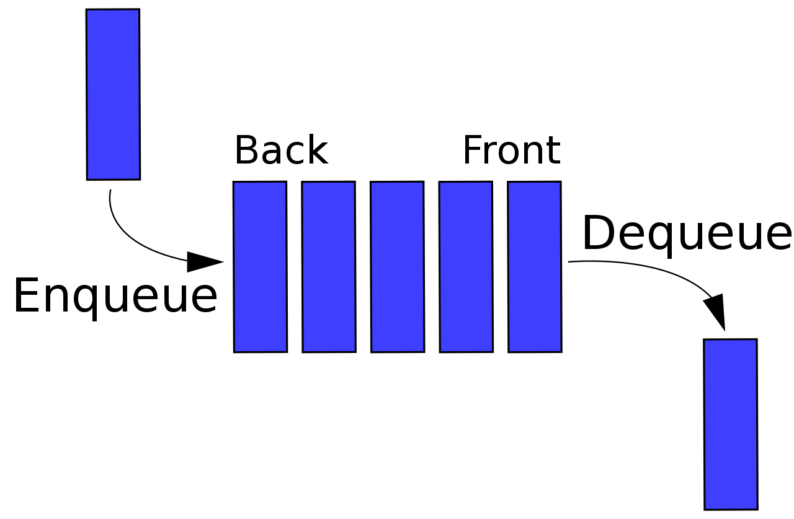

# Queues
Queues are a data structure that follow a "First In, First Out" format (FIFO). In other words, the first item in the structure is also the first to be removed. Some examples include:
- A checkout line at the store
- An an escalator
- Waiting in line at Disneyland

More often than not anything involving a line is a queue. Here we can see a picture of what one looks like:

[provide a picture of a queue]:<>


## Queue Operations
Now that you know what a que is, let's learn how to use it. First off, it is important to create it properly. Queues are created with square brackets [ ]. Now, there are two main operations that will be used.
- Enqueue
- Dequeue

### Enqueue
Enqueue allows you to add an item to the back of the queue. This is accomplished with the append() method. Here is an example:

```python
queue = [] # create an empty queue
queue.append(1) # add 1 to the back of the queue
queue.append(2)
queue.append(3)
queue.append(4)

print(queue) # [1, 2, 3, 4]
```
Big O: O(1)

### Dequeue
Dequeue allows you to remove an item from the front of the queue. This is accomplished one of two ways. The first is removing the first item in the list. The second is using the pop() method. Here is an example of each, showing the value removed and the queue after it is removed.

```python
queue = [1, 2, 3, 4] # create a queue with 4 items
value = queue.pop(0) # remove the first item in the queue
print(value) // 1
print(queue) // [2, 3, 4]
```
Big O: O(n)

```python
queue = [1, 2, 3, 4] # create a queue with 4 items
value = queue[0] # get the first item in the queue
del queue[0] # remove the first item in the queue
print(value) # 1
print(queue) # [2, 3, 4]
```
Big O: O(n)

## Example: Ticket Line
Now that you know how to use a queue, let's take a look at an example. You are the manager of a movie theater and you need to create a program that will allow you to keep track of the people in line for tickets. You will need to be able to add people to the line and remove them when they are done. You will also need to be able to see who is next in line. Here is an example of what your program would look like:

```python
line = [] # create an empty queue
while True:

    # display menu
    print('\nWhat would you like to do?')
    print('1. Add someone to the line')
    print('2. Serve the next person')
    print('3. See who is next')
    print('4. Exit\n')

    # get the user's choice
    choice = input('Enter your choice: ') 

    # add someone to the line
    if choice == '1': 
        name = input('Enter a name: ')
        # add the name to the queue 
        line.append(name) 

    # serve the next person
    elif choice == '2': 
        # check if someone is in line
        if len(line) > 0: 
            # get the first person in line
            name = line.pop(0) 
            print(name + ' has been served.') 
        # line is empty
        else:
            print('The line is empty.')

    # check who is next
    elif choice == '3':
        # check if someone is in line
        if len(line) > 0:
            # get the first person in line
            name = line[0] 
            print(name + ' is next.')
        # line is empty
        else:
            print('The line is empty.')
    # exit
    elif choice == '4': 
        break 

    # invalid choice
    else: 
        print('That is not a valid choice.')
```

## Practice Problem
Create a program that will keep track of how many people are on an escalator. The program should allow for people to get on and off the escalator. It should also allow the user to see how many people are on the escalator at any given time, and display a warning if there are too many people on the escalator. The capacity of the escalator is 10 people.

You can test your program with the following scenarios
- 5 people get on the escalator
- 3 people get off the escalator
- 8 people get on the escalator
- 2 people get off the escalator
- 8 people get off the escalator

Run additional test cases as needed.

After completion, check your work: [Solution](4-queues.py)

[Welcome Page](0-welcome.md)
