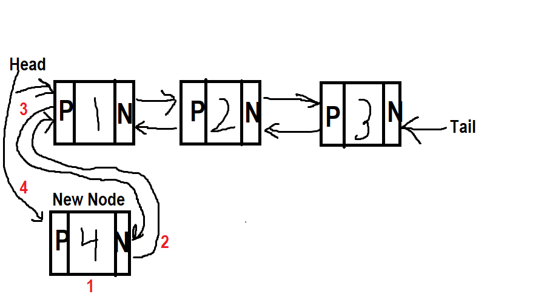
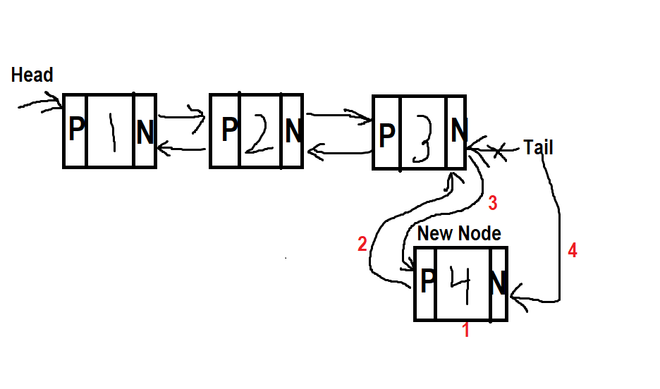
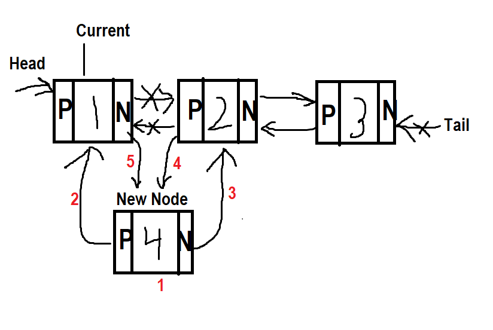
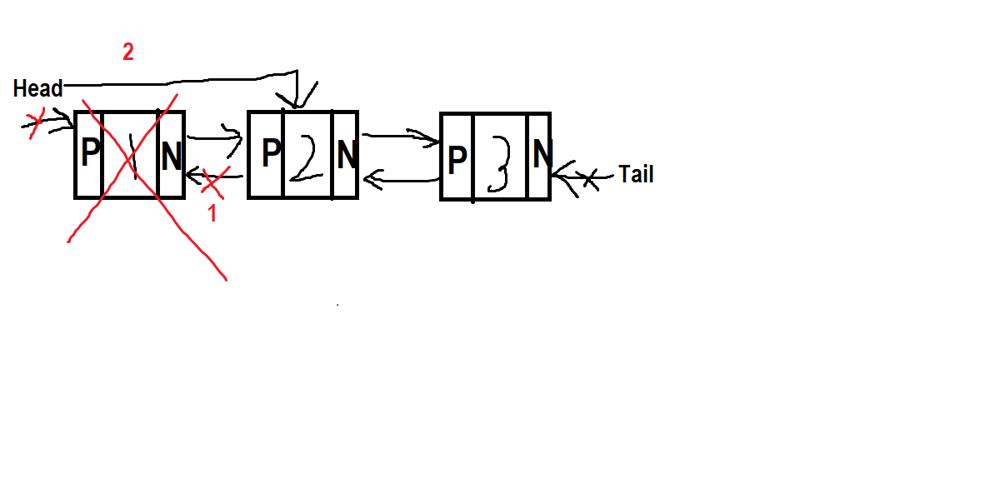
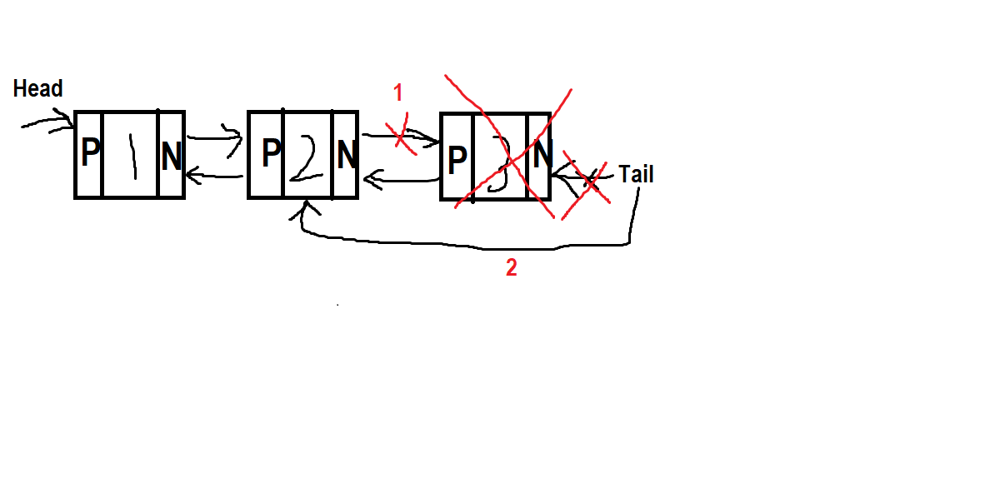
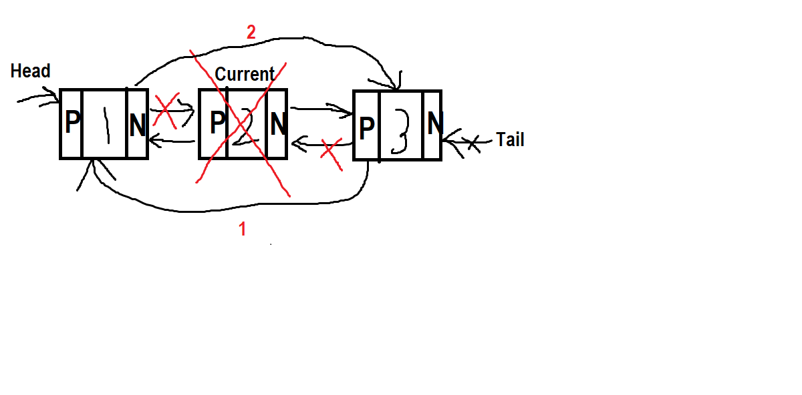

# Linked Lists
Linked lists are a data structure that are used to store a collection of items. They are similar to arrays, but they are different in that they are stored randomly within memory. Because of this, each element, commonly refered to as a node, must have a value and connection to the node before and after it. This connection is a pointer to the memory location. These can be singly or dually linked.

 Some examples include:
- A train
- A web browser history
- A playlist

[provide a picture of a linked list]:<>


## Linked List Operations
Now that you know what a linked list is, let's learn how to use it. A singly linked list is only connected one way, from the head to the tail. It cannot be traversed backwards. A doubly linked list on the other hand can be traversed in both directions. Because of this, we will be focusing on a doubly linked list to fully understand how it works. There are three operations that can be performed on a linked list: insert, remove, and access.

### Inserting into a Linked List
Inserting into a linked list is a little different than inserting into an array. Inserting can be done at the head, the tail, or in the middle, the latter being a little more complicated. Note that the "middle" reffers to anywhere in the list that is not the head or tail. Each explanation will be followed by a visual representation to help improve understanding.
##### Head

```python
# Big O: O(1)
def insert_head(self, value):
    # 1) create a new node
    new_node = Node(value)
    # 2) set the nodes next to the current head
    new_node.next = self.head
    # 3) set the current head's previous to the new node
    self.head.prev = new_node
    # 4) set the head to the new node
    self.head = new_node
```


##### Tail
```python
# Big O: O(1)
def insert_tail(self, value):
    # 1) create a new node
    new_node
    # 2) set the nodes previous to the current tail
    new_node.prev = self.tail
    # 3) set the current tail's next to the new node
    self.tail.next = new_node
    # 4) set the tail to the new node
    self.tail = new_node
```

##### Middle
```python
# Big O: O(n)
def insert_middle(self, value, index):
    # 1) create a new node
    new_node
    # 2)  set the new node's previous to the current node
    new_node.prev = current
    # 3) set the new node's next to the current node's next
    new_node.next = current.next
    # 4) set the next node's previous to the new node
    current.next.prev = new_node
    # 5) set the current node's next to the new node
    current.next = new_node
```

### Removing from a Linked List
Removing can be done at the head, the tail, or in the middle, all of which are done in two simple steps. Note that the "middle" reffers to anywhere in the list that is not the head or tail. Note that if there is only one node in the list, the head and tail would be set to none, leaving the list empty. Each explanation will be followed by a visual representation to help improve understanding.

##### Head
```python
# Big O: O(1)
def remove_head(self):
    # 1) set previous of second node to none
    self.head.next.prev = None
    # 2) set the second node as the head
    self.head = self.head.next

```

##### Tail
```python
# Big O: O(1)
def remove_tail(self):
    # 1) set next of second to last node to none
    self.tail.prev.next = None
    # 2) set the second to last node as the tail
    self.tail = self.tail.prev

```


##### Middle
```python
# Big O: O(n)
def remove_middle(self, index):
    # 1) set the previous of the next node to the node before current
    current.next.prev = current.prev
    # 2) set the next of the previous node to the node after node
    current.prev.next = current.next

```


### Accessing a Linked List
Finding a specific value or node in the list requires looping through the list. This can be done by starting at either the head or the tail. The process is the same either way you go. Pick the direction you want to go then follow the links to the end. Going forward, start at the head and follow the next links to the end. Going bakcwards, start at the tail and follow the previous links to the beginning. We will set up the frameworkand work through a forward traversal.
```python
# Big O: O(n)
def forward(self):
    # start at the head
    current = self.head
    # loop to the end
    while current in not None:
        # perform desired action
        print(current.value)
        # go to next node
        current = current.next
```
This example prints out the value contained in each node.

## Example: Linked List
Now that you know what a linked list is and how to work with it, lets take a look at an example. Create a list of 5 numbers and print them out in reverse order. The list should be created using a linked list. The numbers can be any numbers you want, but they should be in order.
```python
class LinkedList:

    class Number:
        def __init__(self, value):
            self.value = value
            self.next = None
            self.prev = None

    def __init__(self):
        self.head = None
        self.tail = None

    def insert_head(self, value):
        new_node = LinkedList.Number(value)

        if self.head is None:
            self.head = new_node
            self.tail = new_node
        else:
            new_node.next = self.head
            self.head .prev= new_node
            self,head = new_node

    def insert_tail(self, value):
        new_node = LinkedList.Number(value)

        if self.head is None:
            self.head = new_node
            self.tail = new_node
        else:
            new_node.prev = self.tail
            self.tail.next = new_node
            self.tail = new_node

    def forward(self):
        current = self.head
        while current is not None:
            print(current.value)
            current = current.next

    def reverse(self):
        reverse = self.tail
        while reverse is not None:
            print(reverse.value)
            reverse = reverse.prev

# Test
list = LinkedList()
list.insert_head(1)
list.insert_tail(2)
list.insert_tail(3)
list.insert_tail(4)
list.insert_tail(5)
print("Accending order:")  
list.forward() # 1, 2, 3, 4, 5 (head to tail, each number on a new line)
print()
print("Decending order:") 
list.reverse()  # 5, 4, 3, 2, 1 (tail to head, each number on a new line)
```
```
```


## Practice Problem
Create route management program for a delivery service. The program should be able to create a route at the start of the day with a list of stops. If needed the driver should be able to add, or remove, stops mid route if needed. The driver also needs the ability to remove stops on the route as they are completed, from the beginning or end because he/she can start at the top or bottom. The program should display the route to the driver so they can keep track of what has and hasn't been delivered yet.

You can test your program with the following scenarios
- Start the day with a route of 5 stops
- Add a stop to the middle of the route
- Remove a stop from the end of the route
- Remove a stop from the beginning of the route

Test other scenarios as needed to make sure your program works as expected.

After completion, check your work: [Solution](5-linked_lists.py)

[Welcome Page](0-welcome.md)