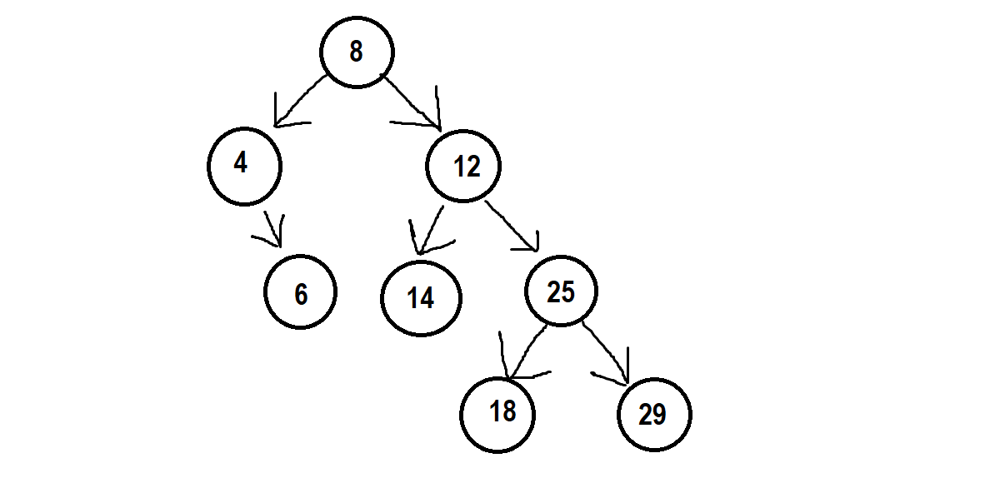
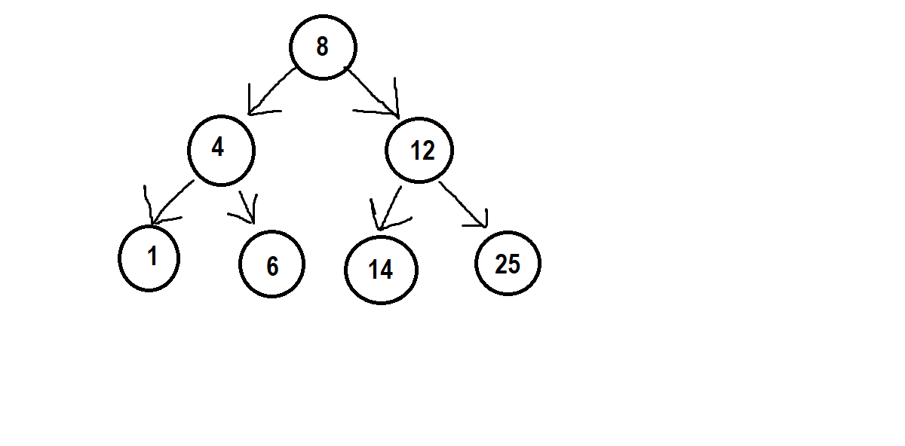

# Binary Search Trees
Binary search trees (BST) are a step up from linked lists. They follow a similar structure, but search trees carry more capabilities. Data is placed into the list based on the value of the parent node. If the data is less than that of the parent node, it is placed on the left. If the data is greater than the parent node, it is placed on the right. This process creates a sorted data structure. There are two main types of search trees: balanced and unbalanced. Balanced trees are more efficient, but unbalanced trees are easier to implement.

- Unbalanced tree are easier to implement, but are less efficient: O(n) time complexity

- Balanced trees are more efficient, but are more difficult to implement: O(log n) time complexity


Whether it is a balanced or unbalanced tree is all dependent on how the data is inserted into the tree. There are two main operations that we will look at with a search tree: inserting and traversing.

## Inserting
Inserting into a search tree is a simple process. First, you must create the tree. This is done by creating a node with a value. Next, you must insert the data into the tree. This is done by comparing the value of the data to the value of the parent node. If the data is less than the parent node, it is placed on the left. If the data is greater than the parent node, it is placed on the right. Using recursion, this process continues until an empty node is found and the data is placed in the tree. The base case is an empty node. The recursive case is the process of comparing the data to the parent node. The process is as follows:

```python
def insert(self, data):
    # Check if the tree is empty
    if self.root is None:
        self.root = BST.Node(data)
    # Recursion case
    else:
        self.root._insert(data)

def _insert(self, data, node):

    # Check the left side
    if data < self.node:
        # Found emmpty node to insert in
        if node.left is None:
            node.left = BST.Node(data)
        # Still not empty, recursion case
        else:
            self.left._insert(data, node.left)
    # Check the right side
    elif data >= node.data:
        # Found empty node to insert in
        if node.right is None:
            node.right = BST.Node(data)
        # Still not empty, recursion case
        else:
            self._insert(data, node.right)
```

## Traversing
Search trees can be traversed  one of two ways. Smallest to largest, or largest to smallest. This is done by using recursion. The process starts at the root node and continues until the end of the tree is reached. The left side of the tree will be traversed first, then the right side. Recursion requires a base case and a recursive case. The base case is an empty tree. The recursive case is the process of traversing the tree. The process is as follows:

```python
def __iter__(self):
    # Cycle through the tree
    yield from self._traverse_forward(self.root)

def _traverse_forward(self, node):
    # Check if the tree is empty
    if node is None:
        return
    # Recursion case
    else:
        yield from self._traverse_forward(node.left)
        yield node.data
        yield from self._traverse_forward(node.right)
```


# Example
Create a simple search tree with the following data: 5, 3, 7, 1, 4, 6. The tree should be able to insert and traverse the tree. The tree should be able to search for a specific value. The tree should be able to delete a value. The tree should be able to update a value. The tree should be able to print the tree.

```python

class Node:
    def __init__(self, value):
        self.value = value
        self.left = None
        self.right = None
    
    def __str__(self):
        return str(self.value)
    
    def __repr__(self):
        return str(self.value)
        
class Tree:
    def __init__(self):
        self.root = None
        
    def insert(self, value):
        if self.root is None:
            self.root = Node(value)
        else:
            self._insert(value, self.root)
            
    def _insert(self, value, node):
        if value < node.value:
            if node.left is None:
                node.left = Node(value)
            else:
                self._insert(value, node.left)
        elif value > node.value:
            if node.right is None:
                node.right = Node(value)
            else:
                self._insert(value, node.right)
        else:
            print("Value already in tree")
            
    def print_tree(self):
        if self.root is not None:
            self._print_tree(self.root)
            
    def _print_tree(self, node):
        if node is not None:
            self._print_tree(node.left)
            print(str(node.value))
            self._print_tree(node.right)
            
    def search(self, value):
        if self.root is not None:
            return self._search(value, self.root)
        else:
            return False
        
    def _search(self, value, node):
        if value == node.value:
            return True
        elif value < node.value and node.left is not None:
            return self._search(value, node.left)
        elif value > node.value and node.right is not None:
            return self._search(value, node.right)
        return False
    
    def delete(self, value):
        if self.root is not None:
            self.root = self._delete(value, self.root)
            
    def _delete(self, value, node):
        if node is None:
            return node
        if value < node.value:
            node.left = self._delete(value, node.left)
        elif value > node.value:
            node.right = self._delete(value, node.right)
        else:
            if node.left is None and node.right is None:
                print("Removing leaf node")
                del node
                return None
            if node.left is None:
                print("Removing node with single right child")
                temp = node.right
                del node
                return temp
            elif node.right is None:
                print("Removing node with single left child")
                temp = node.left
                del node
                return temp
            print("Removing node with two children")
            temp = self._get_predecessor(node.left)

# test cases
tree = Tree()
tree.insert(5)
tree.insert(3)
tree.insert(7)
tree.insert(1)
tree.insert(4)
tree.insert(6)

tree.print_tree()
print(tree.search(4))
print(tree.search(10))

tree.delete(3)


```
# Practice Problem
Create a Search tree to keep track of customer accounts at a bank. The tree should be sorted by the account number. Employees should be able to add new accounts and search for existing accounts. They should also have the option to delete or update an account. The accounts need to be printed out in order. The account information should include the account number and balance.

Test cases:
- Insert accounts 1-10 in a random order
- Search for account 5
- Search for account 11
- Delete account 5
- Update account 6 balance to 1000
- Print the accounts

Run additional test cases as needed.

After completion, check your work: [Solution](6-trees.py)

[Welcome Page](0-welcome.md)

